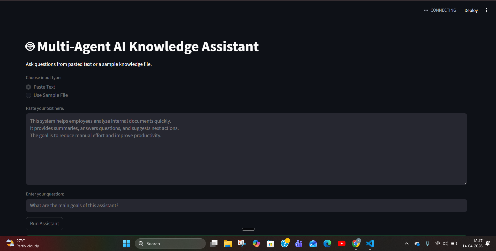

# 🤖 Multi-Agent AI Knowledge Assistant

A GenAI-powered application that uses multiple AI agents and Retrieval-Augmented Generation (RAG) to analyze documents, answer questions, and suggest next actions.

---

## 🚀 Overview

This project demonstrates a real-world **multi-agent AI system** where different agents collaborate to process unstructured data and provide intelligent outputs.

The system accepts user input (text or documents), retrieves relevant context using vector search, and uses multiple AI agents to generate:

- 📄 Summary  
- ❓ Answer to user queries  
- 💡 Recommended next actions  

---

## 🧠 Architecture

User Input → Text Processing → Chunking → Embeddings → FAISS Vector Store → Retrieval  
→ Multi-Agent Processing → Output (Summary + Answer + Recommendations)

---

## 🤖 Agents Used

- **Retriever Agent**  
  Extracts relevant chunks from the knowledge base  

- **Summarizer Agent**  
  Generates concise summaries of retrieved content  

- **Q&A Agent**  
  Answers user questions using context-aware reasoning  

- **Recommendation Agent**  
  Suggests next actions based on insights  

---

## 🛠 Tech Stack

- **Python**
- **LangChain**
- **OpenAI API**
- **FAISS (Vector Database)**
- **Streamlit (UI)**
- **dotenv (Environment management)**

---

## ⚙️ Features

- Multi-agent AI workflow  
- Retrieval-Augmented Generation (RAG)  
- Semantic search using FAISS  
- Context-aware question answering  
- Intelligent recommendation system  
- Interactive Streamlit interface  

---

## ▶️ How to Run

### 1. Clone the repository

```bash
git clone https://github.com/Keerthana8128/multi-agent-ai-knowledge-assistant.git
cd multi-agent-ai-knowledge-assistant
```
